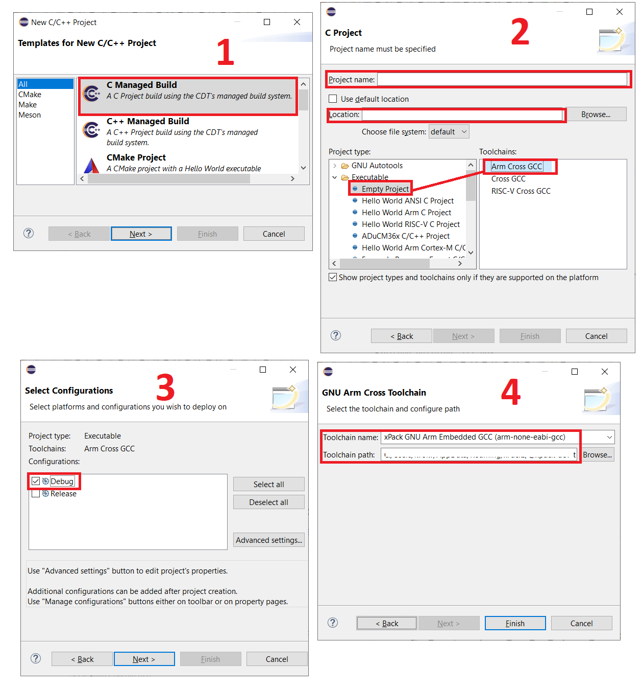
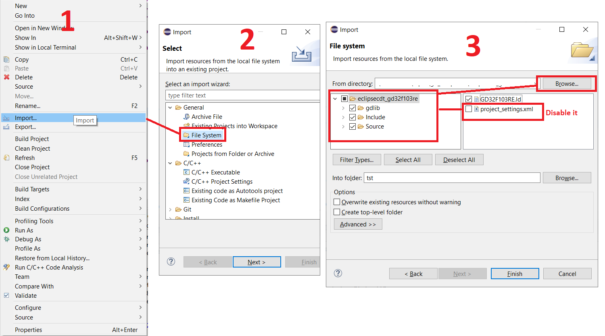
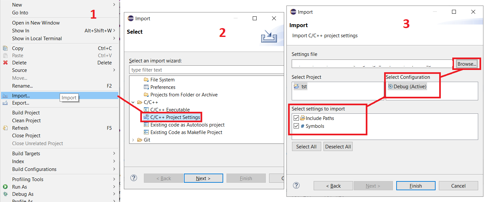
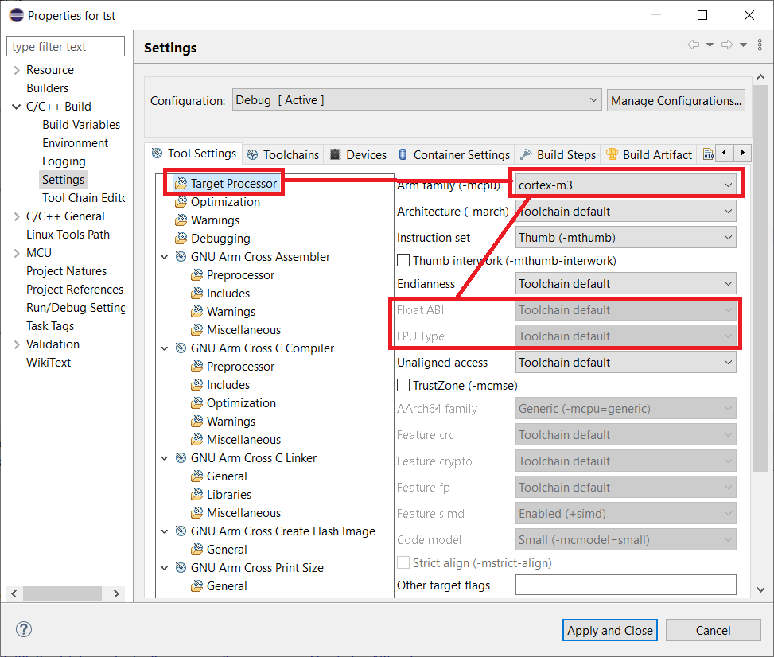
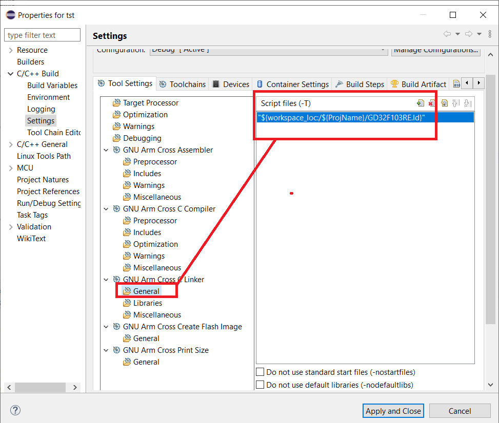
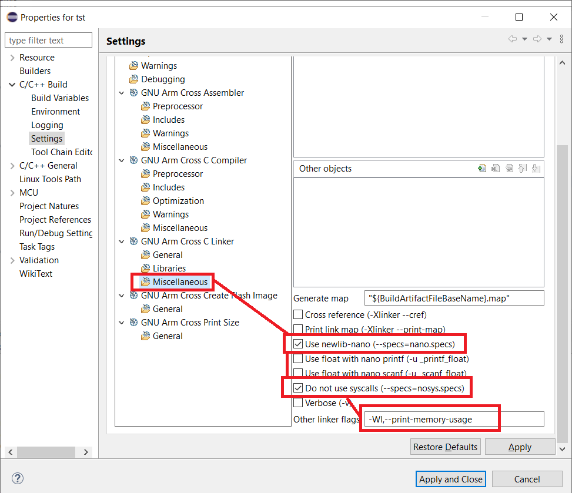
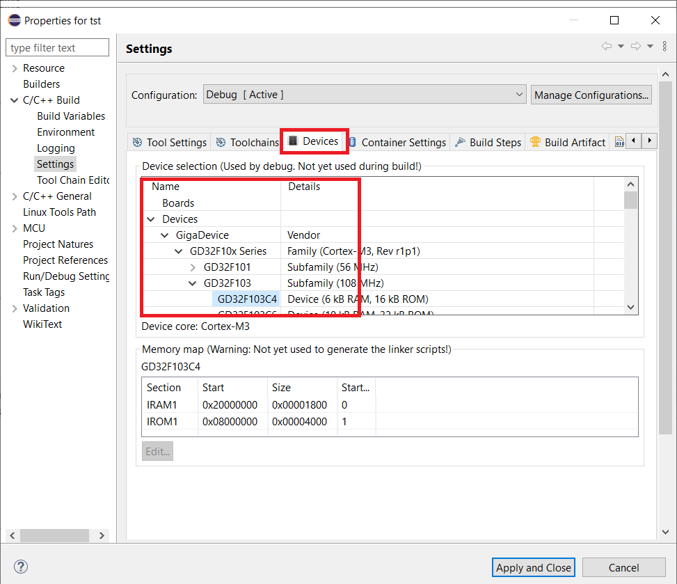
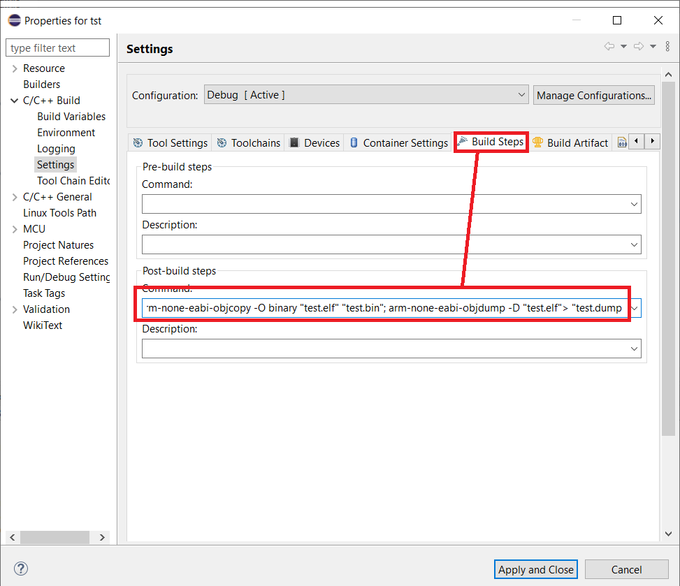
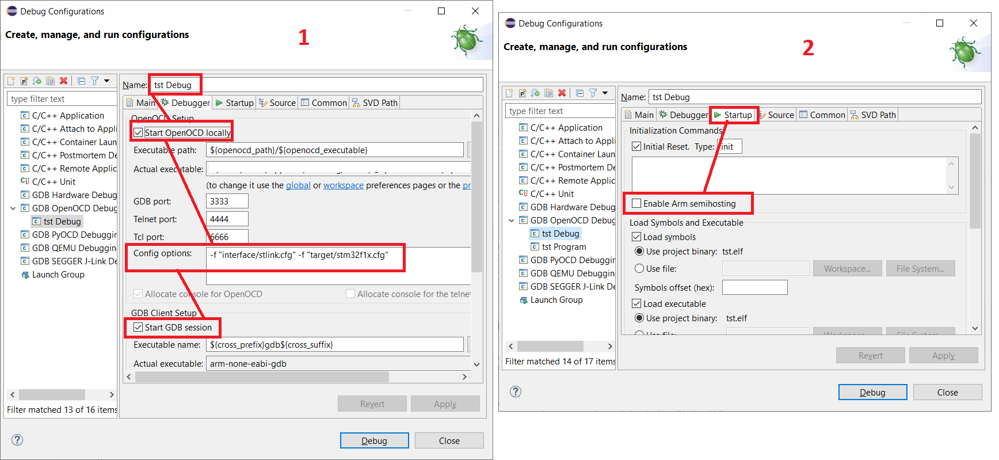
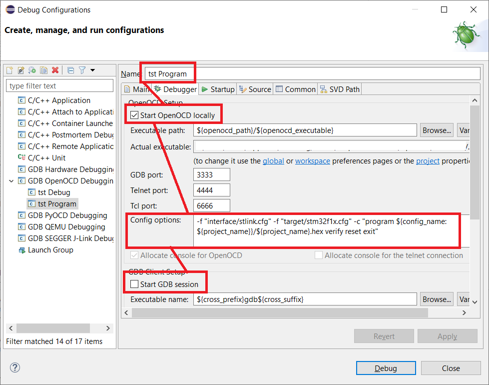

# gd_templates
Project templates for developing GD32 MCU based devices

## Config work space (Eclipse, Windows)
1. Download Eclipse IDE for Embedded C/C++ Developers, unpack, make shortcut on desktop
1. Download Node.js (from nodejs.org), install it
1. Run from command line: `npm install --global xpm@latest`
1. Install ARM GCC Tollchain: `xpm install --global @xpack-dev-tools/arm-none-eabi-gcc@latest --verbose`
1. Install Build Tools: `xpm install --global @xpack-dev-tools/windows-build-tools@latest --verbose`
1. Install OpenOCD: `xpm install --global @xpack-dev-tools/openocd@latest --verbose`
1. Run Eclipse, checkout path configuration of Toolchain, Build Tools and OpenOCD в **Windows - Preferences - MCU - (global sections)**
1. Run perpsective **CMSIS Packs**, update packets (it may took a lot of time). After updating install packages you need. Return to perspective **C/C++**

## Creating new project (Eclipse)
1. Run **File - New - C/C++ Project**

1. Import files from template file system

1. Download Firmware Library for choosen GD32 MCU from official site, unpack it to elsewhere
1. Copy firmware files to project:
	- to directory **gdlib/CMSIS** copy core headers;
	- to directory **gdlib/CMSIS/Include** and **gdlib/CMSIS/Source** common system description files (except startup scripts);
	- to directory **gdlib/Peripherals** files from standard_peripheral directory (folders **Include** and **Source**)
1. Import C/C++ Project Settings from xml file

1. Configurate project settings in **C/C++ build - Settings**:
	- checkout core config and FPU work in **Target Processor**
	
	- include ld script in **GNU Arm Cross C Linker - General**
	
	- enable flags of Linker: *Use newlib-nano* and *Do not use syscalls* in **GNU Arm Cross C Linker - Miscellaneous**
	
	- (optional) Add to linker other flags: `-Wl,--print-memory-usage` in **GNU Arm Cross C Linker - Miscellaneous**
	- (optional) Select correct device name from **Devices - Device selection**
	
	- (optional) Configurate post-build steps as: `arm-none-eabi-objcopy -O binary "test.elf" "test.bin"; arm-none-eabi-objdump -D "test.elf"> "test.dump"` (correct filenames to actual)
	
	- (optional) in section **Toolchain** enable *Create Extended Listing* and then in **Tool Setting** configurate listing options
1. Duplicate configurations for Release (if need). Recommended to setup otimization level for compiler to -Os and debug level to *None* 
1. Configurate launcher for debugging:
	- Create new launcher
	- Add to **Debugger - OpenOCD setup - Config options**:
		- Interface options if using st-link: `-f "interface/stlink.cfg"` or if using evalboard: `-f "interface/cmsis-dap.cfg"`
		- Target options if using F1xx series: `-f "target/stm32f1x.cfg"` or if using F4xx series: `-f "target/stm32f4x.cfg"`
	- Enable *Start GDB Session* in **Debugger - GDB client setup**
	- Disable *Enable Arm Semihosting* in **Startup - Initialization commands**
	
1. Configurate launcher for program and verify (without debugging):
	- Create new launcher
	- Add to **Debugger - OpenOCD setup - Config options**: 
		- Interface options if using st-link: `-f "interface/stlink.cfg"` or if using evalboard: `-f "interface/cmsis-dap.cfg"`
		- Target options if using F1xx series: `-f "target/stm32f1x.cfg"` or if using F4xx series: `-f "target/stm32f4x.cfg"`
		- Option to run program command: `-c "program ${config_name:${project_name}}/${project_name}.hex verify reset exit"`
	- Disable *Start GDB Session* in **Debugger - GDB client setup**
	
